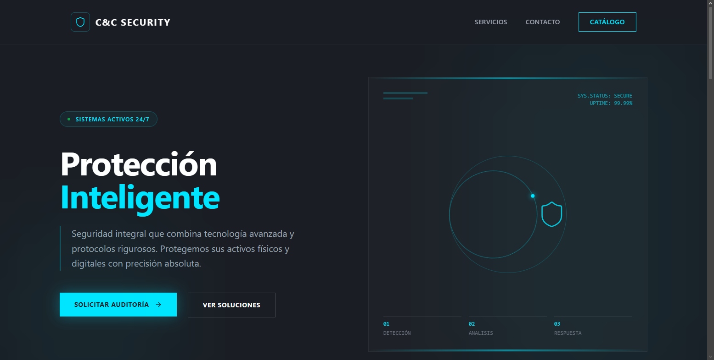
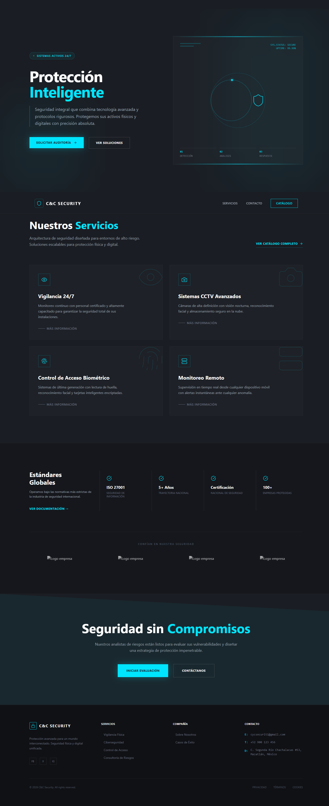

# 🛡️ Cybersecurity Knowledge Base & Tools Web Platform

A modern, interactive web platform dedicated to cybersecurity developed with **React**, designed to centralize guides, vulnerability analysis, IT security best practices, and interactive technical concept demonstrations.

This personal project is part of my software development portfolio, showcasing reactive component design, user experience (UX/UI) principles, and clean frontend architecture.

---

## 📱 Screenshots

| Main Landing | Full Page |
| :---: | :---: |
|  |  |

---

## 🛠️ Tech Stack

* **Core Framework:** [React](https://react.dev/) (Hooks, Context API / Redux Toolkit)
* **Language:** JavaScript (ES6+) / TypeScript
* **Styling & UI:** Tailwind CSS / Styled Components + Lucide React (iconography)
* **Routing:** React Router DOM
* **Build Tool:** Vite / Create React App

---

## ✨ Key Features

* 🔍 **Vulnerability Explorer:** Dedicated modules covering OWASP Top 10, common threats, and mitigation strategies.
* 🛠️ **Interactive Utilities:** Password strength checkers, encoding/decoding simulators (Base64, Hashing), and security header checkers.
* 🎨 **Cyberpunk / Dark Mode Interface:** Tailored dark theme UI optimized for readability and developer aesthetic.
* 📱 **Fully Responsive Design:** Seamlessly adapted for mobile devices, tablets, and high-resolution displays.

---

## 🏗️ Project Structure

src/
 ├── assets/          # Images, icons, and global styles
 ├── components/      # Reusable UI components (Buttons, Cards, Modals)
 ├── context/         # Application-wide global state management
 ├── data/            # Static datasets, security articles, and constants
 ├── pages/           # Core views (Home, Modules, Tools, About)
 ├── services/        # External API integrations and cryptographic helper utilities
 └── App.jsx          # Route configuration and primary layout shell

---

## 🚀 Getting Started

### Prerequisites
* Node.js (v18.x or higher)
* npm or yarn

### Installation Steps

1. **Clone the repository:**
   git clone https://github.com/maccRevolucion/cyc-page.git
   cd security

2. **Install dependencies:**
   npm install

3. **Start the development server:**
   npm run dev

4. Open your browser and navigate to `http://localhost:5173` (or the port indicated in your terminal).

---

## Live Demo

[DEMO PAGE](https://maccrevolucion.github.io/cyc-page/)

## 👤 Author

Developed by **Manuel Cordero** — Software Developer.
* LinkedIn: [Manuel Cordero](https://linkedin.com/in/manuelcordero24)
* GitHub: [@maccRevolucion](https://github.com/maccRevolucion)